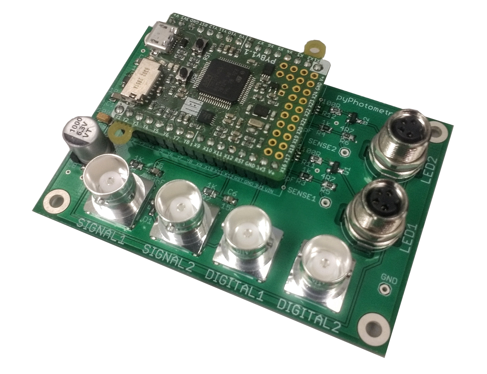

# pyPhotometry Hardware

This repository contains design files for pyPhometry hardware.  For more information see: https://pyphotometry.readthedocs.io/en/latest/user-guide/hardware/

The repository contains the following devices:

## Acquisition board v1.0

The original version of the acquisition board as detailed in the [pyPhotometry manuscript](https://www.nature.com/articles/s41598-019-39724-y), featuring:

-  2 analog inputs (0-3.3V) for photoreceiver signals.
- 2 Digital inputs for registering behavioural events or sync pulses.
- 2 LED driver outputs with 0-100mA adjustable current output.

## Acquisition board v2.0

An updated version of the acquisition board with the following improvements from version 1.0:

- Increased maximum current of 300mA from the LED driver outputs.
- 2 additional LED control outputs for triggering external LED drivers that require a voltage control signal (0-3.3V) , allowing the board to be used with optical hardware like the Doric Gen3 minicubes which have integrated LED drivers.

## Acquisition board case

A plastic case compatible both v1.0 and v2.0 acquisition boards.