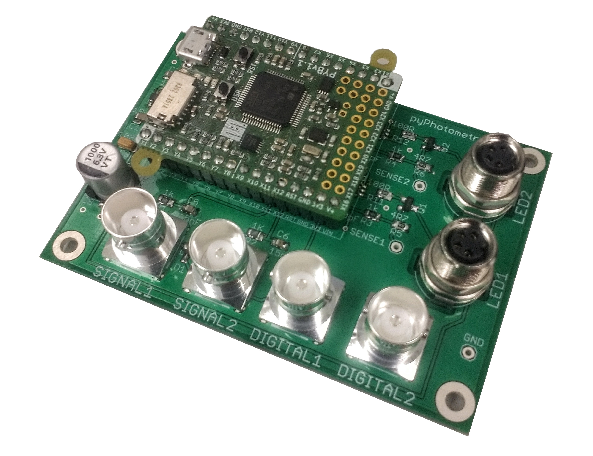

# Acquisition board v1.0

The original pyPhotometry acquisition board as detailed in the manuscript, featuring two analog inputs for photoreceiver signal (0-3.3v), two digital inputs, and two LED drivers with 0-100mA adjustable output.
